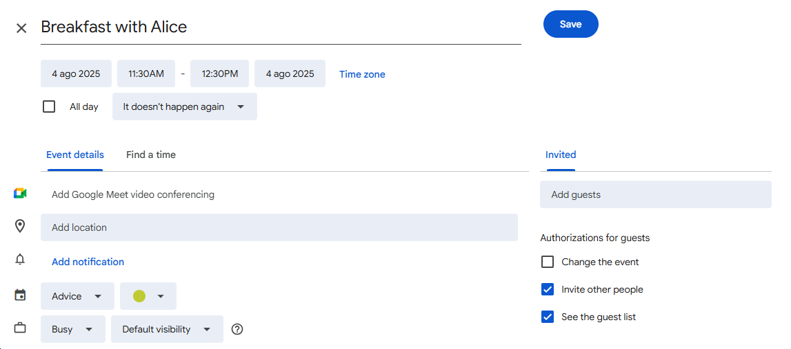

# 📅 Taskly! Your AI-powered Task Planner

Taskly is a natural language AI assistant that **understands your tasks**, **structures them**, and lets you **save them directly into your Google Calendar**.

Just type something like:
```
Tomorrow at 9:30am breakfast with Alice
```

Taskly will:
- Extract the description and time
- Save it in a structured file
- Create the event on Google Calendar (optional)
- Print the event link or confirmation in the terminal

---

## 📸 Screenshots

### ✅ Google Calendar Event Created



### 🎯 Terminal Session

```
🤖 Taskly is active. Type a task like 'Tomorrow at 3pm meeting with Marco'. Type 'bye bye' to exit.

👤 You: Tomorrow at 2pm dentist
📤 Response from AI:
{
  "intent": "add_task",
  "description": "Dentist",
  "datetime": "2025-08-04T14:00:00"
}
📆 Event added to Google Calendar: https://calendar.google.com/event?eid=...
```

---

## 🚀 Features

- 🤖 Natural language task interpretation (NLP via LLM)
- 📅 Auto-add to Google Calendar
- 📂 Saves in `tasks.json` (structured format)
- 🔒 Secure API management via `.env`
- 💬 Terminal-based live interaction
- ✅ Designed as a minimal but extendable MVP

---

## 📁 Project Structure

```
taskly/
├── assets/
│   └── ... images used in README ...
├── data/
│   └── tasks.json ← task archive
├── src/
│   ├── core/
│   │   ├── agent.py ← LLM-based task parser
│   │   ├── planner.py ← JSON saving and reading
│   │   └── calendar_integration.py ← Google Calendar sync
├── credentials/
│   ├── credentials.json ← OAuth client secrets (not versioned)
│   └── token.json ← auto-generated user token
├── .env.example ← sample env config
├── main.py ← main CLI runner
└── pyproject.toml ← Poetry project config
```

---

## 🧠 Tech Stack

- Python 3.11
- [OpenRouter.ai](https://openrouter.ai/) – LLM API
- `requests`, `re`, `json`
- `google-api-python-client` – Calendar integration
- `python-dotenv` – environment management
- Poetry – dependency and environment management

---

## ⚙️ Setup

### 1. Clone the repository

```bash
git clone https://github.com/your-username/taskly.git
cd taskly
```

### 2. Create your `.env` file

```bash
cp .env.example .env
```

Paste your `OPENROUTER_API_KEY` inside.

> You can get it from [https://openrouter.ai/](https://openrouter.ai/)

### 3. Install dependencies with Poetry

```bash
poetry install
```

### 4. Run Taskly

```bash
poetry run python main.py
```

---

## 📦 API Key Management

Your `.env` file should contain:

```dotenv
OPENROUTER_API_KEY=your_openrouter_key_here
```

Best practices:
- Don't commit `.env`
- Include a `.env.example` for collaborators

---

## 📅 Google Calendar Integration

### Requirements:

1. Go to [Google Cloud Console](https://console.cloud.google.com/)
2. Create a project and enable the Calendar API
3. Download `credentials.json` and place it inside `credentials/`
4. The first run will prompt user authorization (only once)

Then your task will be saved directly in your **primary Google Calendar**.

---

## 🔐 Security Notes

- `.env`, `token.json`, and `credentials.json` are **excluded from Git**
- Only `.env.example` is versioned
- All API calls are encrypted over HTTPS

---

## 🛣️ Roadmap

- [ ] Multi-language support
- [ ] Recurring tasks
- [ ] Email notifications
- [ ] GUI interface
- [ ] Web & mobile support

---

## 📄 License

This project is for educational and experimental purposes.
Contributions welcome under the MIT license.
